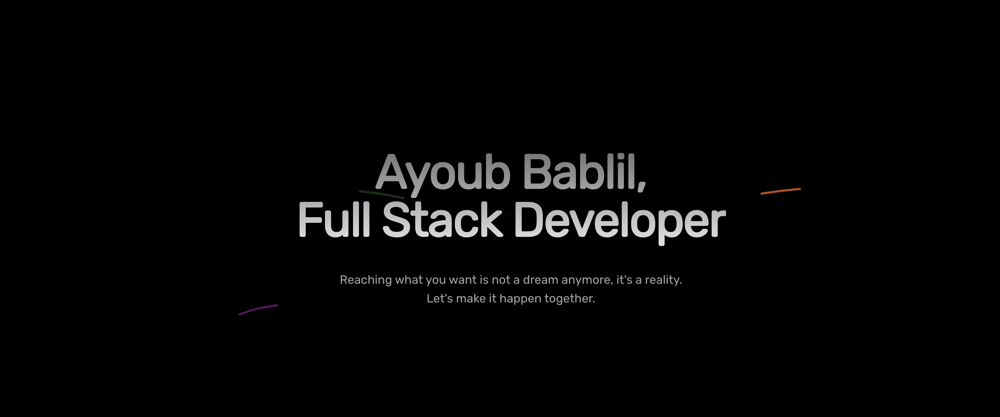

[](https://abablil.me)

<div align="center">

**Software Engineer & Full Stack Developer — Paris, France**

Full stack from pixel to deploy. Web · mobile · infra.

[](https://abablil.me)
[](https://linkedin.com/in/bablilayoub)
[](https://x.com/bablilayoub)
[](mailto:ayoub@abablil.me)

</div>

## 👋 Hi there

```ts
export const ayoub = {
  name: 'Ayoub Bablil',
  role: 'Software Engineer & Full Stack Developer',
  based: 'Paris, France',
  experience: '5+ years shipping for real users',

  now: [
    { role: 'Software Engineer', at: 'Amplified Industries', since: 'Sep 2026' },
    { role: 'Founder',           at: 'Forgo.dev',            since: 'Jan 2026' },
    { role: 'Student',           at: '1337 School / 42 Paris', since: '2023'   },
    { role: 'Freelance Developer', at: 'Independent',        since: '2019'     },
  ],

  building: ['nixploy', 'openhole', 'runnerly', 'forgo'],

  focus: [
    'Self-hosted infrastructure & developer tooling',
    'Full stack products — UI, APIs, deploy',
    'Open source when it matters',
  ],

  links: {
    website: 'https://abablil.me',
    email: 'ayoub@abablil.me',
    x: '@bablilayoub',
  },
} as const;
```

## 🚀 What I'm building

<table>
<tr>
<td width="50%" valign="top">

### [Nixploy](https://nixploy.com)
Open-source, self-hostable **PaaS** — turns any Docker host into a full deployment platform. Git deploys, Traefik TLS, databases with backups, live monitoring, 86 one-click templates, CLI and MCP.

`TypeScript` `Docker Swarm` `Traefik` `Nixpacks`

[](https://github.com/bablilayoub/nixploy/stargazers)

[Repo](https://github.com/bablilayoub/nixploy) · [Site](https://nixploy.com)

</td>
<td width="50%" valign="top">

### [OpenHole](https://openhole.dev)
Expose localhost to the internet in **one command**. No accounts, no API keys — `openhole 3000` gives a public HTTPS URL. Self-hostable ngrok alternative.

`Go` `Next.js` `Docker` `Caddy`

[](https://github.com/bablilayoub/openhole/stargazers)

[Repo](https://github.com/bablilayoub/openhole) · [Site](https://openhole.dev)

</td>
</tr>
<tr>
<td width="50%" valign="top">

### [Runnerly](https://runnerly.dev)
Run GitHub Actions on your own infrastructure. Installs, registers, supervises and retires self-hosted runners — one command from a bare machine to running jobs.

`Go` `GitHub Actions` `Docker` `Linux`

[](https://github.com/bablilayoub/runnerly/stargazers)

[Repo](https://github.com/bablilayoub/runnerly) · [Site](https://runnerly.dev)

</td>
<td width="50%" valign="top">

### [Forgo](https://forgo.dev)
Multi-platform **no-code builder** focused on shipping real products — design once, export to web, desktop and mobile.

`Next.js` `PostgreSQL` `Node.js` `TypeScript`

[Site](https://forgo.dev)

</td>
</tr>
</table>

<details>
<summary><b>More work</b> — 1337 / 42 projects & earlier builds</summary>

<br>

| Project | What it is | Stack |
| --- | --- | --- |
| [webserv](https://github.com/bablilayoub/webserv) | HTTP/1.1 web server built from scratch | C++ |
| [minishell](https://github.com/bablilayoub/minishell) | Unix shell — parsing, pipes, redirections, builtins | C |
| [cub3D](https://github.com/bablilayoub/cub3D) | Raycasting engine / first-person maze game | C |
| [philosophers](https://github.com/bablilayoub/philosophers) | Threads, mutexes and the dining philosophers problem | C |
| [push_swap_turk](https://github.com/bablilayoub/push_swap_turk) · [radix](https://github.com/bablilayoub/push_swap_radix) | Stack sorting with a minimal instruction set | C |
| [push_swap_tester](https://github.com/bablilayoub/push_swap_tester) | Test harness for push_swap, used across 1337 / 42 | Shell |
| [1337-42-Launcher](https://github.com/bablilayoub/1337-42-Launcher) | macOS desktop & app launcher for 1337 / 42 clusters | Shell |
| [NiceHalf-Framework](https://github.com/bablilayoub/NiceHalf-Framework) | Production-ready open source PHP framework | PHP |
| [gethim](https://github.com/bablilayoub/gethim) | Short-link platform with click tracking | PHP |

</details>

## 🧰 Stack

**Languages**

[](https://abablil.me)

**Frontend & Mobile** — React, Next.js, Angular, React Native / Expo, Tailwind, Shadcn/UI

[](https://abablil.me)

**Backend & Data** — Laravel, Node.js, Fastify, Express, .NET, REST, GraphQL, WebSockets

[](https://abablil.me)

**Infra & Cloud** — Docker Swarm, Traefik, CI/CD, Linux, Cloudflare, AWS, GCP

[](https://abablil.me)

**Desktop & Tools** — Electron, Tauri, Chrome extensions, CLI tools, Stripe, OAuth/JWT, OpenAI API

[](https://abablil.me)

## 📈 GitHub Stats

<div align="center">


</div>

## 📣 Get in touch

Need a product built end-to-end — web, mobile, infra? Let's ship something real.

[](https://abablil.me)
[](https://linkedin.com/in/bablilayoub)
[](https://x.com/bablilayoub)
[](mailto:ayoub@abablil.me)

<div align="center">

<sub>Paris, France — working remotely with clients globally</sub>

</div>
