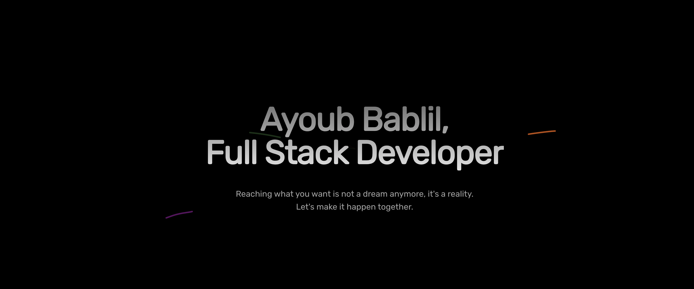

Hey there 👋

Hello, my name is Ayoub and I am a seasoned full-stack developer with over eight years of experience. I have expertise in eight programming languages and possess a strong passion for programming. I am always excited to work with new clients and help them bring their ideas to life using my programming skills. I believe in collaborating closely with my clients to ensure that they are fully satisfied with the end product. I am committed to delivering excellent results and I assure you that I will do a great job for you. Let's work together to showcase your brand to the world.

Want to know more about me? [Check out my website.](https://nicehalf.com)

## &#x1f4c8; GitHub Stats

 

 

## &#x1f4c8; 42 Stats

 

  
 

## 💼 Skills

## 📣 How can you contact me?

> You can contact me through my official website
>
> [My Website](https://nicehalf.com) 
